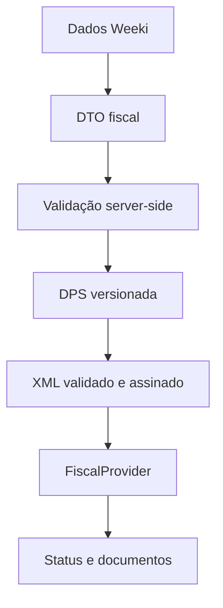

# Módulo Fiscal / NFS-e — Weeki

## Estado da entrega

O módulo Fiscal está disponível na navegação e em **Configurações → Fiscal**. A experiência visual permite configurar dados, serviços, automação, preparar rascunhos, consultar status e histórico. O ambiente é sempre identificado como teste.

Nenhuma NFS-e real é emitida nesta etapa. Certificado, DPS/XML oficial, API Nacional, DANFSe, armazenamento e notificações falham de forma fechada até que a infraestrutura e a homologação sejam concluídas. O modo visual não inventa números, chaves, PDFs, XMLs, e-mails enviados ou autorizações.

## Arquitetura

- `shared/fiscal.ts`: DTOs e estados internos independentes do provedor.
- `shared/fiscal-validation.ts`: CPF/CNPJ e validações de prestador, tomador, serviço, competência, valor e certificado.
- `features/fiscal/`: feature flags, estado visual sandbox e eventos internos do frontend.
- `components/fiscal/`: visão geral, notas, emissão inteligente, detalhe/timeline e configurações.
- `server/fiscal/provider.ts`: contrato `FiscalProvider`.
- `server/fiscal/providers/national-nfse.ts`: adapter nacional deliberadamente em standby.
- `server/fiscal/service.ts`: autorização, idempotência, transições de estado e conciliação.
- `server/fiscal/repository.ts`: SQL sempre escopado por workspace.
- `server/fiscal/api.ts`: rotas autenticadas e erros seguros.
- `server/fiscal/certificate-store.ts`: contrato server-only para KMS/Vault.
- `server/fiscal/document-store.ts`: contrato para PDF/XML em storage privado.
- `server/fiscal/notifications.ts`: contrato futuro para e-mail e WhatsApp.
- `server/domain/events.ts`: outbox desacoplado para `payment.confirmed` e `service.completed`.

Fluxo projetado:

O frontend nunca constrói, assina ou envia XML.

## Experiência do usuário

### Fiscal

- **Visão geral:** indicadores mensais, estados, notas recentes e progresso do primeiro uso.
- **Notas fiscais:** busca e filtros por período, cliente, serviço, status, valor e origem; tabela no desktop e cards no celular.
- **Emitir NFS-e:** cliente e serviço preenchem os dados conhecidos; depois da tentativa aparecem somente os campos faltantes.
- **Detalhe:** dados da nota, prestador, tomador, origem, vínculos, erros seguros e timeline.
- **Configurações fiscais:** dados da empresa, serviços fiscais, certificado, automação e provedor.

### Configurações gerais

A área geral foi preservada e tornou-se uma central com visão geral e busca. Está acessível pelo rodapé fixo da barra desktop, pelo avatar, por `Ctrl/Cmd + K` e por um botão próprio na navegação móvel.

Preferências de perfil, região e aparência continuam locais enquanto o núcleo da Weeki não migrar para o backend. Integrações e controles de segurança que dependem de autenticação exibem standby e não simulam sucesso.

## Status internos

| Status | Significado |
| --- | --- |
| `DRAFT` | Registro incompleto ou ainda não preparado |
| `PENDING` | Validado e aguardando integração/execução |
| `PROCESSING` | Reserva criada ou retorno oficial ainda incerto |
| `AUTHORIZED` | Autorização confirmada pelo provedor |
| `REJECTED` | Rejeição fiscal confirmada |
| `CANCELLED` | Preparação cancelada ou cancelamento confirmado |
| `ERROR` | Falha segura e reprocessável após correção |

O status bruto fica separado em `providerStatus`. Uma resposta atrasada não pode recriar uma emissão. Em timeout, a nota permanece `PROCESSING`; é obrigatório consultar o estado oficial antes de qualquer retransmissão.

## Banco de dados

Migration: `server/migrations/002_fiscal.sql`.

| Entidade | Finalidade |
| --- | --- |
| `weeki_core.domain_events` | Outbox idempotente de eventos internos |
| `weeki_fiscal.profiles` | Perfil fiscal por workspace |
| `weeki_fiscal.automation_settings` | Preferências de gatilho e pós-autorização |
| `weeki_fiscal.certificates` | Referência opaca do cofre + metadados; nunca PFX/senha |
| `weeki_fiscal.service_configs` | Configuração fiscal reutilizável dos serviços |
| `weeki_fiscal.nfse` | Snapshot da nota, status, vínculos e hash idempotente |
| `weeki_fiscal.nfse_events` | Histórico imutável para timeline/auditoria |
| `weeki_fiscal.nfse_documents` | Referências únicas a PDF/XML no storage |
| `weeki_fiscal.nfse_errors` | Código, tentativa e contexto técnico sanitizado |

O schema não é exposto ao navegador. `PUBLIC` não recebe privilégios. A aplicação deve usar papel de runtime restrito; o papel de migration deve ser separado.

## API interna

Todas as rotas, exceto o health check sem dados, exigem sessão válida. Escritas também exigem `Origin` exata.

| Método e rota | Uso |
| --- | --- |
| `GET /api/fiscal/health` | Estado do módulo/ambiente, sem segredos |
| `GET /api/fiscal/overview` | Perfil, serviços, automação, notas e metadados públicos |
| `PUT /api/fiscal/profile` | Salvar perfil fiscal |
| `PUT /api/fiscal/automation` | Salvar automação |
| `POST /api/fiscal/services` | Criar/atualizar configuração de serviço |
| `GET /api/fiscal/notes` | Listar notas do workspace |
| `POST /api/fiscal/notes` | Criar rascunho com chave idempotente |
| `GET /api/fiscal/notes/:id` | Consultar nota do workspace |
| `POST /api/fiscal/notes/:id/prepare` | Validar e colocar em espera |
| `POST /api/fiscal/notes/:id/issue` | Reservar e emitir quando habilitado |
| `POST /api/fiscal/notes/:id/cancel` | Cancelar apenas registros ainda não transmitidos |

Cancelamento/substituição fiscal, documentos e envio ainda não têm endpoints públicos porque os respectivos serviços reais não estão configurados.

## Idempotência e eventos

- A criação usa `(workspace_id, request_key)` único e um SHA-256 do pedido normalizado.
- Mesma chave e mesmo conteúdo devolvem o registro existente.
- Mesma chave com conteúdo diferente retorna conflito.
- Antes da chamada externa, a nota é gravada como `PROCESSING` com o número da tentativa.
- Um segundo clique encontra `PROCESSING` e não chama o provedor outra vez.
- Falha confirmada é persistida antes de a API devolver o erro.
- Timeout não muda para `ERROR`; permanece incerto até consulta oficial.
- `payment.confirmed` nasce no livro financeiro apenas quando a primeira receita é inserida. Webhooks repetidos não geram outro evento.

## Provedor e DPS

`FiscalProvider` contém `issueNfse`, `getNfse`, `cancelNfse`, `replaceNfse`, `getPdf`, `getXml`, `getMunicipalParameters`, `validate` e `getStatus`. A camada de aplicação não depende do formato do Sistema Nacional, Focus NFe ou PlugNotas.

`DpsSource` é construído exclusivamente a partir do DTO interno. `OfficialDpsCodec` deverá ser versionado conforme os XSDs e anexos oficiais. `StandbyDpsCodec` não gera XML aproximado.

Documentação oficial verificada em 10/09/2026:

- [Documentação técnica da NFS-e](https://www.gov.br/nfse/pt-br/biblioteca/documentacao-tecnica)
- [Documentação de produção](https://www.gov.br/nfse/pt-br/biblioteca/documentacao-tecnica/documentacao-atual)
- [Produção restrita / homologação](https://www.gov.br/nfse/pt-br/biblioteca/documentacao-tecnica/producao-restrita)
- [APIs de produção restrita e produção](https://www.gov.br/nfse/pt-br/biblioteca/documentacao-tecnica/apis-prod-restrita-e-producao)

As URLs permanecem vazias no repositório. Antes de implementar transporte, fixe a versão de leiaute/XSD, os parâmetros do município aderente, a autenticação mTLS/certificado aplicável e os contratos vigentes do ambiente escolhido.

## Variáveis e feature flags

| Variável | Padrão seguro | Finalidade |
| --- | --- | --- |
| `NEXT_PUBLIC_FISCAL_MODULE_ENABLED` | `true` | Mostrar/ocultar a experiência visual |
| `NEXT_PUBLIC_FISCAL_API_ENABLED` | `false` | Reservada para o cutover do cliente HTTP autenticado |
| `FISCAL_MODULE_ENABLED` | `true` | Habilitar rotas do backend |
| `FISCAL_ENVIRONMENT` | `sandbox` | Ambiente fiscal do servidor |
| `FISCAL_LIVE_ENABLED` | `false` | Segundo bloqueio explícito para produção |
| `NFSE_NATIONAL_INTEGRATION_ENABLED` | `false` | Habilitar adapter nacional após homologação |
| `NFSE_AUTO_ISSUE_ENABLED` | `false` | Habilitar worker automático depois da integração |
| `NFSE_WHATSAPP_ENABLED` | `false` | Reservada; permanece sem automação falsa |
| `NFSE_NATIONAL_BASE_URL` | vazio | URL oficial fixada por ambiente no servidor |
| `FISCAL_KMS_KEY_ID` / `FISCAL_CERTIFICATE_VAULT_PATH` | vazio | Cofre gerenciado do A1 |
| `FISCAL_DOCUMENT_BUCKET` | vazio | Storage privado de XML/PDF |

Nunca use `NEXT_PUBLIC_` em um secret. Consulte `.env.example`.

## Segurança

- sessão OIDC HttpOnly e autorização por membership/workspace;
- body limitado, validação Zod e anti-CSRF por origem;
- certificado e senha somente no cofre server-side;
- referência interna do certificado não é retornada pela API;
- PDF/XML em bucket privado, com uma única cópia e URLs assinadas curtas;
- logs sem documentos, e-mails completos, payload bruto, XML, certificado ou senha;
- erros públicos em português, com códigos técnicos apenas no histórico interno;
- rate limiting/WAF distribuído deve ser configurado no proxy antes da ativação;
- princípio de menor privilégio para banco, cofre, storage e runtime.

## Adicionar outro provedor

1. Implementar `FiscalProvider` sem alterar os DTOs da aplicação.
2. Mapear status externos para os estados internos.
3. Manter credenciais/certificados no servidor e validar ownership/ambiente.
4. Registrar o adapter no registry.
5. Acrescentar testes de contrato, rejeição, timeout, idempotência e documentos.
6. Homologar em workspace piloto antes de habilitar a feature flag.

## Troubleshooting

| Sintoma | Diagnóstico seguro |
| --- | --- |
| Fiscal não aparece | Confirmar `NEXT_PUBLIC_FISCAL_MODULE_ENABLED` no build |
| API retorna 401 | Sessão OIDC ausente/expirada; não usar perfil local como autenticação |
| Escrita retorna 403 | Conferir mesma origem HTTPS e papel owner/admin |
| “Conclua a configuração fiscal” | Completar prestador e ao menos um serviço |
| Certificado pendente | Configurar KMS/Vault; não criar coluna de senha ou upload direto |
| Nota em `PROCESSING` após timeout | Consultar o provedor; não reenviar nem apagar a reserva |
| Chave idempotente em conflito | O mesmo identificador foi usado com conteúdo diferente |
| PDF/XML indisponível | Documento ainda não autorizado ou storage privado não configurado |
| Pagamento não dispara nota | Conferir outbox e flags; a emissão automática real permanece em standby nesta fase |
| Build Hostinger não encontra Tailwind | Executar instalação completa; dependências de compilação estão em `dependencies` |
